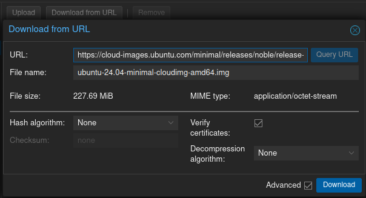

# Proxmox template VMs
Create vm template in proxmox using prepared script.  
For additional reaserch you can use external sources like:
- https://github.com/JamesTurland/JimsGarage/tree/main/Kubernetes/Cloud-Init
- https://forum.proxmox.com/threads/cloud-init-for-fedora-based-distros-doesnt-work.112225/
- https://www.virtualizationhowto.com/2024/02/proxmox-containers-with-fedora-coreos-install/

# Manual examples
- Copy script ./scripts/createCustomizedTemplateVM.sh into proxmox node and execute it:
    ```sh
    vi createCustomizedTemplateVM.sh
    chmod +x createCustomizedTemplateVM.sh
    ./createCustomizedTemplateVM.sh --help
    # Create default cloud init template
    ./createCustomizedTemplateVM.sh --template-id '9999' 
    ```
    If you choose to use ssh-pub-keys (./createCustomizedTemplateVM.sh --ssh-public-keys "./ssh-pub-keys.key") then you can login to machine like this:
    ```sh
    ssh -i ~/.ssh/id_ed25519 buntuuser@<vm-ip-address>
    ```

- Ubuntu:
    - Run script:
    ```sh
    ./createCustomizedTemplateVM.sh --image-file '/var/lib/vz/template/iso/ubuntu-24.04-minimal-cloudimg-amd64.img' \
    --image-url 'https://cloud-images.ubuntu.com/minimal/releases/noble/release-20240608/ubuntu-24.04-minimal-cloudimg-amd64.img' \
    --template-id '9000' \
    --template-name 'Ubuntu-24.04-min-CI-SSH' \
    --template-pass 'buntupass' \
    --template-user 'buntuuser' \
    --ssh-public-keys "./ssh-pub-keys.key"
    ```
    - Or manually step by step:  
    Download image from url in proxmox https://cloud-images.ubuntu.com (example urls [on day 10 06 2024]: https://cloud-images.ubuntu.com/minimal/releases/noble/release-20240608/ubuntu-24.04-minimal-cloudimg-amd64.img or https://cloud-images.ubuntu.com/noble/20240608/noble-server-cloudimg-amd64.img) and use this tutorial: https://github.com/JamesTurland/JimsGarage/tree/main/Kubernetes/Cloud-Init.  
    

- Fedora CoreOS:

    - FCOS prepared for OKD 4.15 deployment:
    ```sh
    ./createCustomizedTemplateVM.sh --image-file '/var/lib/vz/template/iso/fedora-coreos-39.20240210.3.0-qemu.x86_64.qcow2.xz' \
    --image-url 'https://builds.coreos.fedoraproject.org/prod/streams/stable/builds/39.20240210.3.0/x86_64/fedora-coreos-39.20240210.3.0-qemu.x86_64.qcow2.xz' \
    --template-id '3002' \
    --template-name 'FCOS-39-Clean-QCOW2' \
    --template-storage-name 'big-data' \
    --skip-cloud-init-settings
    ```

    - In future FCOS versions it is possible that cloud-init will work due to afterburn proxmoxve support (https://github.com/coreos/afterburn/pull/1023)
    ```sh
    ./createCustomizedTemplateVM.sh --image-file '/var/lib/vz/template/iso/fedora-coreos-40.20240519.3.0-qemu.x86_64.qcow2.xz' \
    --image-url 'https://builds.coreos.fedoraproject.org/prod/streams/stable/builds/40.20240519.3.0/x86_64/fedora-coreos-40.20240519.3.0-qemu.x86_64.qcow2.xz' \
    --template-id '5000' \
    --template-name 'FCOS-40-1.14-CI-SSH' \
    --template-pass 'fedorapass' \
    --template-user 'fedorauser' \
    --ssh-public-keys "./ssh-pub-keys.key"
    ```

    - If you plan to use FCOS alone try using below tutorials:
        - https://git.geco-it.net/GECO-IT-PUBLIC/fedora-coreos-proxmox
        - https://www.virtualizationhowto.com/2024/02/proxmox-containers-with-fedora-coreos-install/
        - https://wiki.geco-it.net/public:pve_fcos


    - Clean without cloudinit settings:
    ```sh
    ./createCustomizedTemplateVM.sh --image-file '/var/lib/vz/template/iso/fedora-coreos-40.20240519.3.0-live.x86_64.iso' \
    --image-url 'https://builds.coreos.fedoraproject.org/prod/streams/stable/builds/40.20240519.3.0/x86_64/fedora-coreos-40.20240519.3.0-live.x86_64.iso' \
    --template-id '4000' \
    --template-name 'FCOS-40-1.14-Clean' \
    --skip-cloud-init-settings
    ```

    - Other example:
    ```sh
    ./createCustomizedTemplateVM.sh --image-file '/var/lib/vz/template/iso/fedora-coreos-39.20231101.3.0-live.x86_64.iso' \
    --image-url 'https://builds.coreos.fedoraproject.org/prod/streams/stable/builds/39.20231101.3.0/x86_64/fedora-coreos-39.20231101.3.0-live.x86_64.iso' \
    --template-id '2000' \
    --template-name 'FCOS-39.20231101.3.0-Clean' \
    --template-storage-name 'big-data' \
    --skip-cloud-init-settings \
    --boot-from-cdrom-iso \
    --skip-image-scsi-attachment
    ```

- CentOS:
    - Run script:
    ```sh
    ./createCustomizedTemplateVM.sh --image-file '/var/lib/vz/template/iso/CentOS-Stream-GenericCloud-x86_64-9-20240527.0.x86_64.qcow2' \
    --image-url 'https://cloud.centos.org/centos/9-stream/x86_64/images/CentOS-Stream-GenericCloud-x86_64-9-20240527.0.x86_64.qcow2' \
    --template-id '6000' \
    --template-name 'CentOS-S9-Cloud-CI-SSH' \
    --template-pass 'centospass' \
    --template-user 'centosuser' \
    --ssh-public-keys "./ssh-pub-keys.key"
    ```

- Fedora Cloud
    - Run script:
    ```sh
    ./createCustomizedTemplateVM.sh --image-file '/var/lib/vz/template/iso/Fedora-Cloud-Base-Generic.x86_64-40-1.14.qcow2' \
    --image-url 'https://download.fedoraproject.org/pub/fedora/linux/releases/40/Cloud/x86_64/images/Fedora-Cloud-Base-Generic.x86_64-40-1.14.qcow2' \
    --template-id '7000' \
    --template-name 'FedoraCloud-40-1.14-CI-SSH' \
    --template-pass 'fedorapass' \
    --template-user 'fedorauser' \
    --ssh-public-keys "./ssh-pub-keys.key"
    ```

